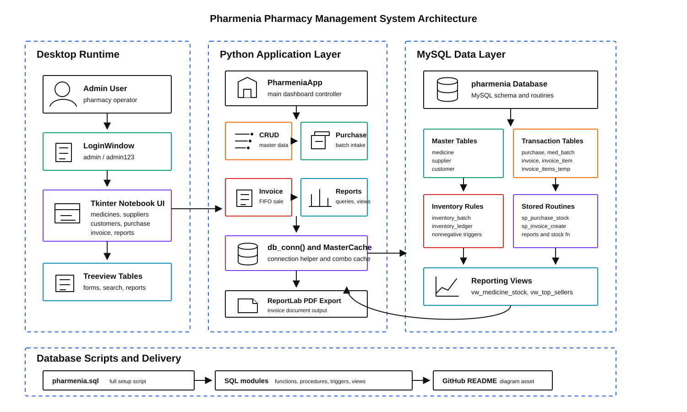

# 💊 Pharmenia — Pharmacy Management System

> A full-featured desktop pharmacy management system built with **Python UI (Tkinter) + MySQL**, featuring a normalized 3NF database, stored procedures, triggers, cursors, views, and a PDF invoice generator.

---

## 📌 Project Overview

Pharmenia is a desktop admin application designed for small to mid-sized pharmacies. It handles the complete operational lifecycle — from purchasing medicine stock and managing suppliers, to generating GST-compliant invoices with automatic FIFO batch consumption and PDF export.

The backend is a fully normalized **MySQL** database with stored procedures, triggers, cursor-based invoice processing, and business views — making it a strong demonstration of advanced DBMS concepts in a real-world context.

---

## ✨ Features

- 🔐 **Admin Login** — Simple credential-gated entry before the dashboard loads
- 💊 **Medicines Management** — add, search (by name or salt), and delete medicines with live stock display
- 🏭 **Suppliers Management** — full CRUD for supplier master data with GSTIN support
- 👥 **Customers Management** — customer records with Walk-in de-duplication utility
- 📦 **Purchase Module** — multi-line purchase entry with batch tracking, expiry dates, GST %, and stock update via stored procedure
- 🧾 **Invoice Module** — live medicine search, FIFO batch consumption via cursor-based stored procedure, PDF download via ReportLab
- 📊 **Inventory Reports** — out-of-stock alerts, near-expiry batches (configurable days), top sellers (last 90 days), date-range sales summary
- 📈 **Business Reports** — purchase records by date range, customer revenue breakdown by day

---

## 🏗️ Architecture

The diagram below shows how the Tkinter desktop UI, Python controller/helper layer, MySQL routines, normalized tables, inventory ledger, reporting views, and PDF invoice export fit together.

<p align="center">
  
</p>

---

## 🗂️ Project Structure

```
pharmenia/
│
├── pharmenia_admin_app.py   # Main Tkinter UI — login + 7-tab dashboard
├── backup.py                # Database backup utility
│
├── pharmenia.sql            # Master script — full schema + seed data (run this first)
├── norm.sql                 # Normalization demo (UNF → 1NF → 2NF → 3NF)
├── pkfk.sql                 # PK/FK verification queries
├── functions.sql            # 3 stored functions (stock, expiry check, invoice total)
├── stored_proce.sql         # 3 stored procedures (sales summary, purchase report, customer revenue)
├── trig_cursor.sql          # 5 triggers + 1 cursor-based invoice procedure.
├── views.sql                # 3 views (medicine stock, top sellers, near-expiry 30d)
│
└── assets/
    └── architecture.svg     # README architecture diagram
```

---

## 🧱 Database Design

### Schema (3NF — 10 tables)

| Table | Purpose |
|---|---|
| `customer` | Customer master; unique constraint prevents duplicate Walk-in rows |
| `supplier` | Supplier master with GSTIN |
| `medicine` | Medicine master — name, salt, form factor (ENUM), HSN, MRP |
| `purchase` | Purchase header (optional bookkeeping per supplier invoice) |
| `med_batch` | One row per supplier batch — batch code, expiry, purchase price, GST % |
| `inventory_batch` | Current stock per batch (canonical quantity table) |
| `inventory_ledger` | Immutable movement log — `+PURCHASE`, `-INVOICE`, `+/-ADJUST` |
| `invoice` | Sales invoice header — date, customer |
| `invoice_item` | Invoice line items at batch-level granularity with unit price |
| `invoice_items_temp` | Staging table for cursor-based invoice creation (truncated after each use) |

### Normalization

`norm.sql` demonstrates the full normalization journey:

- **UNF** — items packed into a single `TEXT` column, customer details repeated per invoice
- **1NF** — one item per row, atomic columns, composite primary key
- **2NF** — invoice header separated from line items (partial dependency removed)
- **3NF** — medicine master extracted (transitive dependency removed)

---

## ⚙️ Database Objects

### Triggers (5)

| Trigger | Table | Purpose |
|---|---|---|
| `trg_inv_nonneg_ins` | `inventory_batch` | Blocks INSERT with negative stock |
| `trg_inv_nonneg_upd` | `inventory_batch` | Blocks UPDATE that would make stock negative |
| `trg_mb_check_bi` | `med_batch` | Validates expiry ≥ purchase date; non-negative price & GST |
| `trg_ii_check_bi` | `invoice_item` | Validates qty > 0 and unit_price ≥ 0 on sales lines |
| `trg_medicine_clean_bi` | `medicine` | Trims name/salt/HSN, uppercases HSN, rejects empty name or negative MRP |

### Stored Functions (3)

| Function | Returns | Purpose |
|---|---|---|
| `fn_stock_available(medicine_id)` | `INT` | Total stock across all batches for a medicine — used by UI search grid |
| `fn_is_near_expiry(batch_id, days)` | `TINYINT` | Returns 1 if a batch expires within N days |
| `fn_invoice_total(invoice_id)` | `DECIMAL(12,2)` | Sum of qty × unit_price for all lines on an invoice |

### Stored Procedures (5)

| Procedure | Purpose |
|---|---|
| `sp_add_medicine` | Normalized insert into medicine master from UI |
| `sp_purchase_stock` | Creates batch + inventory row + ledger entry; adds stock |
| `sp_invoice_create` | **Cursor-based** — iterates staged lines; FIFO batch consumption by earliest expiry |
| `sp_sales_summary` | Revenue and units sold by medicine for a datetime range |
| `sp_purchase_report` | Purchase line details (supplier, batch, qty, price, total) for a date window |
| `sp_customer_revenue` | Daily revenue per customer for a date window |

### Views (3)

| View | Purpose |
|---|---|
| `vw_medicine_stock` | Current total stock per medicine (aggregated across batches) |
| `vw_top_sellers` | Top medicines by units sold in the last 90 days |
| `vw_near_expiry_30d` | Batches expiring within 30 days with current qty |

---

## 🔄 FIFO Invoice Flow (Cursor Logic)

The invoice creation uses a **MySQL cursor** inside `sp_invoice_create` to process each medicine line in order:

1. UI stages requested lines into `invoice_items_temp`
2. Procedure opens a cursor over the temp table
3. For each medicine, a `WHILE` loop picks the **earliest non-expired batch** with available stock (`ORDER BY expiry_date ASC`)
4. Takes as much as possible from that batch (`LEAST(needed, available)`)
5. Writes the invoice line, decrements `inventory_batch`, appends to `inventory_ledger`
6. Continues to the next batch if quantity still remains
7. Raises `SQLSTATE '45000'` if stock runs out mid-fulfillment
8. Truncates `invoice_items_temp` after successful commit

---

## 🖥️ UI Tabs

| Tab | What it does |
|---|---|
| **Medicines** | Add medicine via `sp_add_medicine`; live search by name/salt using `fn_stock_available`; delete |
| **Suppliers** | Add/delete suppliers; GSTIN stored for GST compliance |
| **Customers** | Add/delete customers; "Keep single Walk-in" de-duplication button |
| **Purchase** | Build multi-line purchase; commit all lines via `sp_purchase_stock` |
| **Invoice** | Live-search medicine (debounced, 150ms); keyboard nav (↑↓ arrows, Enter); add lines; create invoice via `sp_invoice_create`; download PDF |
| **Inventory Reports** | Near-expiry (configurable days), out-of-stock, top sellers (90d), date-range sales summary |
| **Business Reports** | Purchase records + customer revenue, both by date range via stored procedures |

---

## 🚀 Quick Start

### Prerequisites

- Python 3.9+
- MySQL 5.7+ or MySQL 8
- pip

### 1. Install Python dependencies

```bash
pip install mysql-connector-python reportlab
```

### 2. Set up the database

```sql
-- Run in MySQL Workbench or CLI (run pharmenia.sql first — it drops & recreates the DB)
source pharmenia.sql;

-- Then apply additional objects (triggers, cursor procedure, views, functions):
source trig_cursor.sql;
source views.sql;
source functions.sql;
source stored_proce.sql;
```

> `pharmenia.sql` already includes all objects inline. The separate files (`trig_cursor.sql`, `views.sql`, etc.) are standalone versions for reference and re-deployment.

### 3. Configure the DB connection

Open `pharmenia_admin_app.py` and update the connection block:

```python
DB = dict(
    host="127.0.0.1",
    user="root",
    password="your_password",   # ← change this
    database="pharmenia",
    auth_plugin="mysql_native_password"
)
```

### 4. Run the app

```bash
python pharmenia_admin_app.py
```

**Default admin credentials:**

```
User ID  : admin
Password : admin123

You can change this in the app.py
```

> ⚠️ These are hardcoded for demo purposes. Change them in `LoginWindow.try_login()` before any real deployment.

---

## 📄 PDF Invoice

After creating an invoice in the Invoice tab, click **"Download PDF"** to save a formatted A4 invoice using ReportLab. The PDF includes invoice number, date, customer name, itemized lines (medicine, batch, qty, unit price), and total amount.

---

## 🔍 Verify Database Objects

Run `pkfk.sql` to list all PKs, FKs, triggers, procedures, functions, and views:

```sql
source pkfk.sql;
```

Or manually:

```sql
SHOW TRIGGERS FROM pharmenia;
SHOW PROCEDURE STATUS WHERE Db='pharmenia';
SHOW FUNCTION STATUS WHERE Db='pharmenia';
SHOW FULL TABLES IN pharmenia WHERE Table_type='VIEW';
```

---

## 📦 Dependencies

| Package | Purpose |
|---|---|
| `mysql-connector-python` | MySQL database connectivity |
| `reportlab` | PDF invoice generation |
| `tkinter` | Desktop UI (bundled with Python) |

---

## 📜 License

This project is built for academic and educational purposes.

